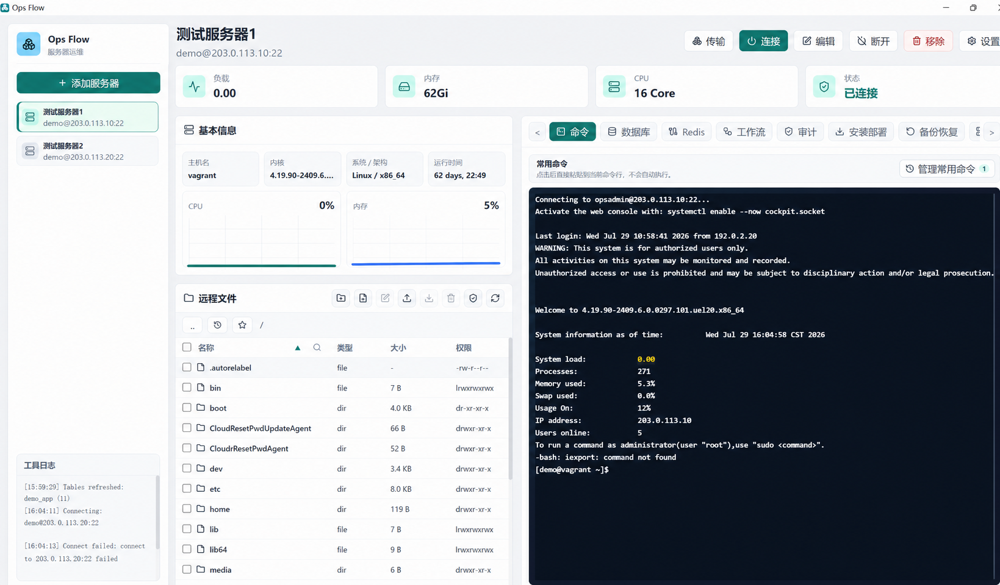
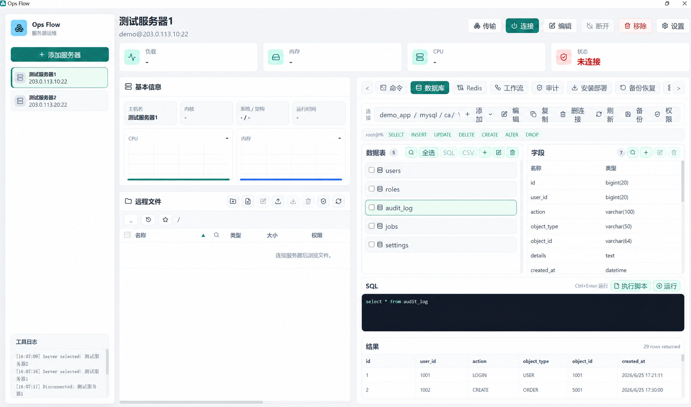
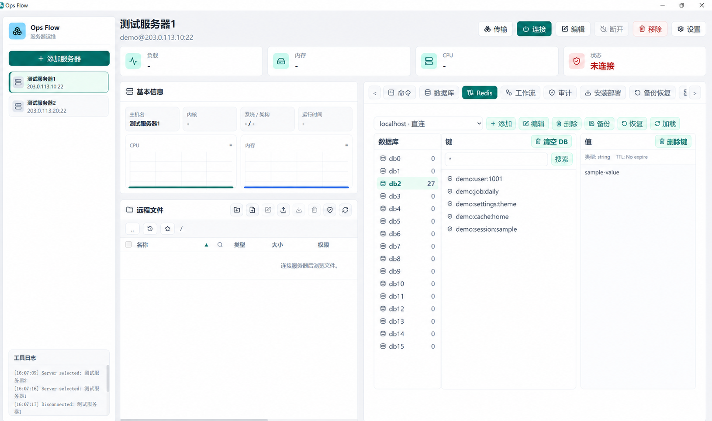
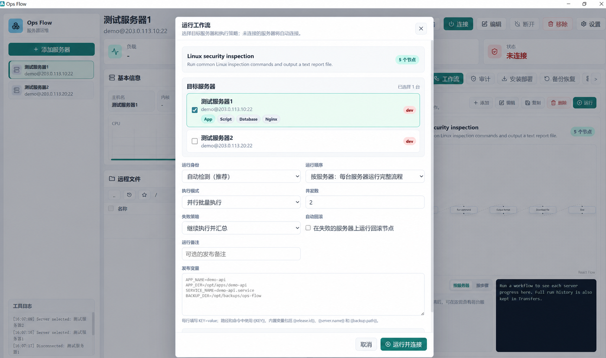
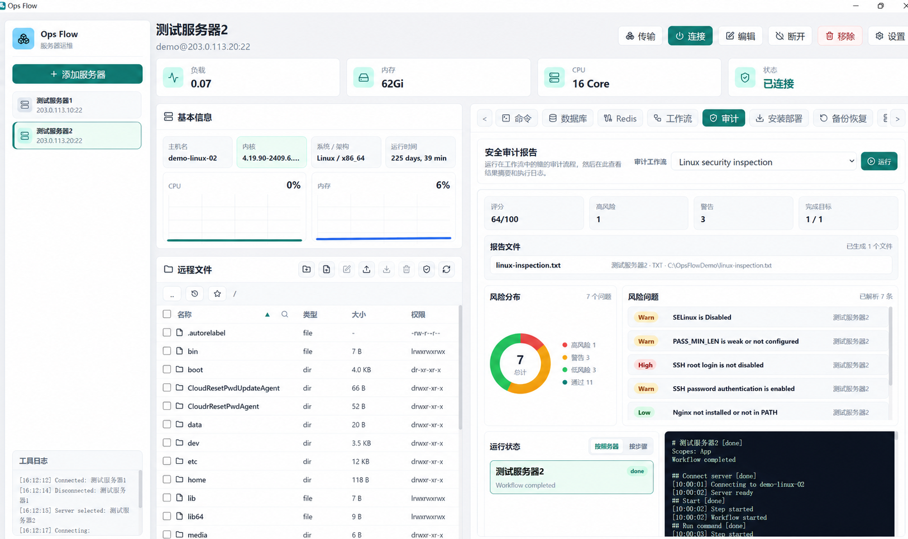
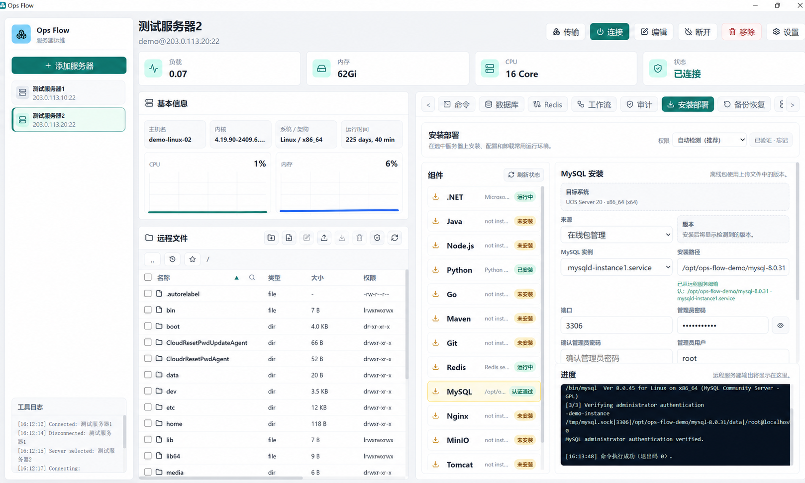
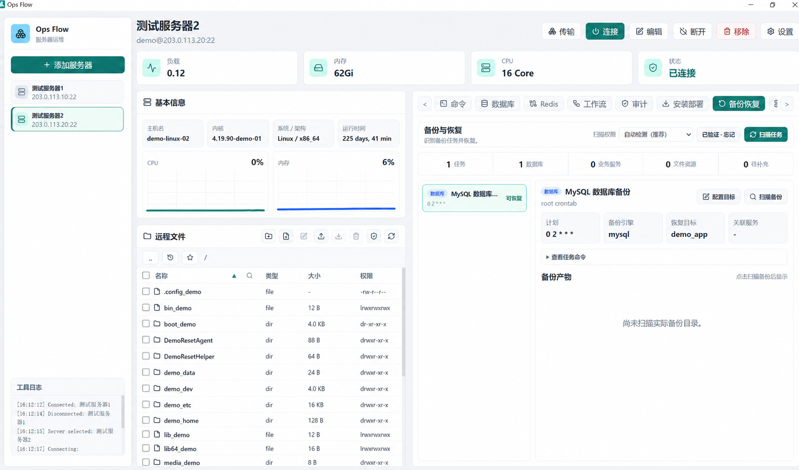
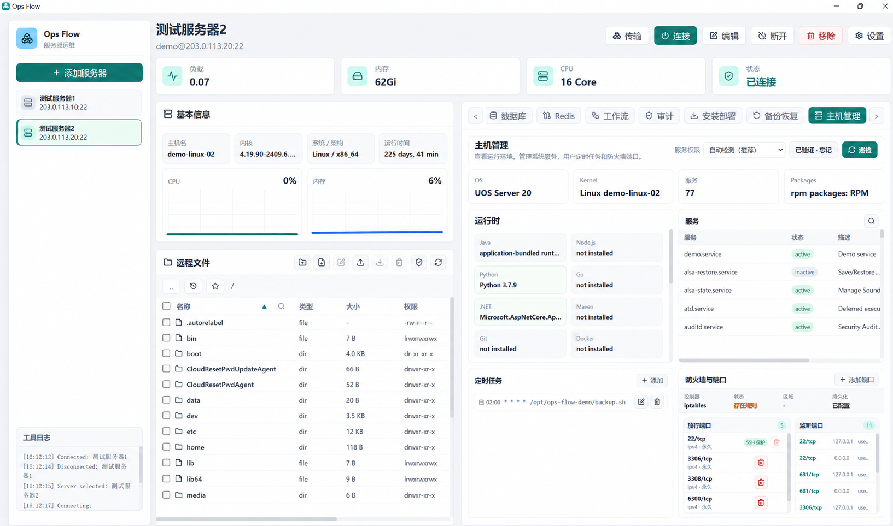

# Ops Flow Plus

Ops Flow Plus 是一个面向服务器日常运维、部署与排障的 Windows 桌面工具，
将 SSH 终端、SFTP 文件管理、数据库、Redis、工作流、安全审计、安装部署、
备份恢复和主机管理集中在一个客户端中。

项目全部功能统一提供，并依据
[Mozilla Public License 2.0](./LICENSE) 开放源代码。

## 下载与安装

请从 [GitHub Releases](https://github.com/qinyouxuan/ops-flow/releases/latest)
下载最新版本：

- `Ops.Flow.Plus.Setup.*.exe`：Windows x64 安装包
- `Ops.Flow.Plus-*-win.zip`：免安装版本
- `SHA256SUMS.txt`：发布文件完整性校验值

下载后建议先核对 SHA-256。当前公开构建未使用受信任的 Windows
代码签名证书，因此 Windows 可能显示 SmartScreen 提醒；请只从本仓库的
Release 页面获取安装文件。

## 功能预览

### 终端与远程文件

连接 Linux 服务器后，可在同一界面使用交互式终端、查看资源概览并管理远程文件。

[](./docs/images/terminal-files.png)

### 数据库与 Redis

数据库和 Redis 连接是独立资源，可由 Windows 本机直接连接，也可通过已保存的
SSH 服务器访问内网实例。

| 数据库管理 | Redis 管理 |
| --- | --- |
| [](./docs/images/database.png) | [](./docs/images/redis.png) |

### 工作流与安全审计

工作流支持多服务器批量执行、并发控制、角色范围、运行身份和失败回滚；
审计页面汇总检查结果、风险等级、报告文件和执行日志。

| 工作流执行 | 安全审计 |
| --- | --- |
| [](./docs/images/workflow.png) | [](./docs/images/audit.png) |

### 安装部署、备份恢复与主机管理

| 安装部署 | 备份恢复 |
| --- | --- |
| [](./docs/images/install-deploy.png) | [](./docs/images/backup-restore.png) |

[](./docs/images/host-management.png)

以上截图使用专用演示数据和
[RFC 5737](https://www.rfc-editor.org/rfc/rfc5737) 文档示例地址，不对应真实服务器。

## 主要功能

- SSH 服务器连接管理、SSH 跳板链、交互式终端和实时资源概览
- 仅监听本机的持久 SSH 端口隧道，供达梦、Oracle、DBeaver 等外部客户端使用
- SFTP 文件浏览、搜索、上传、下载、编辑、重命名、备份和删除
- 最近路径、收藏路径以及带名称、标签和备注的常用命令
- MySQL、PostgreSQL、SQL Server、Oracle，以及可选的达梦数据库连接与 SQL 操作
- 自动适配各数据库系统元数据并展示字段注释，新增连接无需额外配置注释查询
- 只读 SQL 查询按数据库分页展示，并可分批全量导出 Excel、查看进度或取消
- 数据库逻辑备份和 SQL/GZIP 脚本导入，不要求额外安装数据库命令行客户端
- Redis 数据库与键浏览、常用维护操作、`.opsredis` 逻辑备份与恢复
- 可视化工作流、批量服务器执行、角色范围、运行身份和失败回滚
- 安全审计、系统服务、定时任务、防火墙和监听端口检查
- Java、Node.js、Python、Go、.NET、Redis、MySQL、Nginx 等运行环境检测与部署
- 备份任务发现、备份产物校验及人工确认后的恢复操作
- 配置加密导出、解密预览和跨电脑导入
- 上传、下载、部署和 SQL 文件任务的统一进度与取消控制

## 支持范围

- 桌面客户端目前支持 Windows x64。
- SSH、SFTP、命令、工作流、安装部署、系统服务、运行环境检测、备份恢复和
  主机管理以远程 Linux 服务器为主要目标。
- 没有公网 IP 的服务器可在连接配置中选择一台已保存的 SSH 跳板服务器。目标
  主机地址由跳板服务器所在网络访问，终端、SFTP、工作流、部署和主机管理会
  自动复用该链路；支持多级跳板并会拒绝循环配置。跳板机的 `sshd` 需要允许
  TCP 转发（通常为 `AllowTcpForwarding yes`）。
- 数据库和 Redis 连接作为独立的全局资源保存，不随左侧当前服务器切换；可从
  Windows 本机直接连接，也可固定选择一台已保存的 Linux SSH 服务器作为跳板，
  无需先连接命令终端。
- Windows Server 可以在配置 OpenSSH 后尝试基础终端和文件操作，但远程部署、
  Windows 服务、计划任务、防火墙和运行环境管理尚未完整支持。

## 通过 SSH 跳板连接内网服务器

1. 先添加并测试具有公网 IP 的 SSH 服务器，连接方式保持“直接连接”。
2. 再添加内网服务器，主机填写跳板机可访问的“内网服务器地址”，
   并在“SSH 跳板服务器”中选择前一步保存的公网服务器。
3. 填写内网服务器自身的 SSH 用户和密码或私钥，然后测试并保存连接。

连接路径为 `Ops Flow → 公网跳板机 → 内网服务器`。实现使用 SSH 的
`direct-tcpip` 转发通道，不会在 Windows 本机创建固定监听端口，也不要求内网
服务器拥有公网地址。如果测试提示跳板机无法访问目标，请从跳板机检查内网路由、
目标 SSH 端口和防火墙，并确认跳板机未禁用 TCP 转发。

## 为外部客户端创建本地 SSH 隧道

1. 点击顶部“隧道”，添加一条隧道配置。
2. 选择负责访问目标网络的已保存 SSH 服务器。该服务器自身可以继续使用多级跳板链。
3. 设置本地端口、目标主机和目标端口。例如把
   `127.0.0.1:5231` 转发到“内网数据库地址”的 `5236` 端口。
4. 保存前可点击“测试连接”，验证 SSH 登录、跳板链以及目标端口是否可达。
5. 启动隧道后，在达梦管理工具、Oracle SQL Developer 或 DBeaver 等外部客户端中
   连接 `127.0.0.1:5231`；数据库账号和密码仍填写目标数据库自身的凭据。

基础版隧道只监听 `127.0.0.1`，不会向局域网或公网暴露数据库端口。隧道独立于
命令终端运行，手动停止或退出 Ops Flow 时会关闭本地监听和全部转发连接。本地端口
被其他程序占用、SSH 连接断开或目标端口不可达时，界面会显示对应状态。

## SQL 查询分页与 Excel 导出

- 单条 `SELECT` 或 `WITH` 只读查询由数据库按页返回，默认每页 100 行，可在结果区
  切换为 50、100、200 或 500 行；界面不会先读取全部结果再截取。
- 结果区的“导出 Excel”会重新执行同一条只读查询，按批次读取全量结果并直接写入
  `.xlsx`。已导出行数、完成、失败与取消统一显示在顶部“传输”。
- 更新、删除、DDL 等非只读语句不能使用查询结果导出，避免因导出而再次执行数据变更。
  Excel 单工作表最多保存 1,048,575 行数据，另保留一行表头。
- 分页和分批导出建议按唯一键 `ORDER BY`，保证各批次顺序稳定；如果导出过程中源数据
  仍在变化，结果以各批次实际读取时的数据库状态为准。

## 数据备份与恢复

- 数据库逻辑备份支持 MySQL/MariaDB、PostgreSQL、SQL Server、Oracle 和达梦。
  结构备份会按各引擎的系统目录或元数据接口读取表、主键、二级索引、外键、
  检查/唯一约束、视图、触发器，以及存储过程、函数或包。
- 生成的恢复脚本按表结构、表数据、约束与索引、存储程序、视图、触发器排列。
  建议恢复到相同数据库引擎和兼容版本的空数据库或空模式。
- `.sql` 与 `.sql.gz` 都可以通过“选择脚本”导入，选择后点击“运行”开始执行。大文件由主进程流式解析和执行，
  不会一次性载入编辑器；同目录存在对应 `.sha256` 文件时会在执行前校验，
  没有校验文件的第三方导出脚本也可以执行。
- Redis 备份使用 `.opsredis` 流式文件保存每个键的 `DUMP` 内容和过期时间，并生成
  `.sha256`。恢复时可选择跳过已有键、覆盖已有键或遇到冲突停止。

## 达梦数据库

达梦 `dmdb` 驱动受厂商许可证约束，不包含在公开依赖和安装包中。需要使用达梦时，
请先阅读
[达梦 Node.js 接口文档](https://eco.dameng.com/document/dm/zh-cn/app-dev/JavaScript_NodeJs)
以及所安装版本随附的 `LICENSE`，在独立目录自行安装并接受厂商许可证：

```powershell
mkdir C:\OpsFlowDrivers
cd C:\OpsFlowDrivers
npm.cmd init -y
npm.cmd install dmdb
```

然后在“设置 → 常规 → 达梦数据库”中选择
`C:\OpsFlowDrivers\node_modules\dmdb`。Ops Flow 只保存本机路径并从原目录加载，
不会复制驱动，也不会把驱动路径或文件放入配置备份。

如果旧版达梦服务端连接时出现 `Unknown cipher`，可在同一设置区域开启
“兼容旧版达梦”。该模式仅在隔离子进程中使用本机 Node.js 和旧算法兼容能力，
不会影响 Ops Flow 主进程及其他数据库连接。可以升级数据库服务端时，应关闭
兼容模式并使用现代加密算法；不要通过关闭 `loginEncrypt` 绕过登录保护。

## 配置与安全

- 连接密码和私钥优先使用 Electron `safeStorage` 结合当前系统用户保护。
- 服务器、数据库、Redis、工作流、命令和历史记录保存在 Electron 用户数据目录中，
  不属于源码，也不会自动打进安装包。
- 跨电脑迁移请使用软件内的“导出加密配置”和“解密并导入”，并通过独立安全渠道
  传递备份密码。
- 工作流、部署、删除、恢复、防火墙和服务操作可能改变远程服务器状态，
  执行前应确认服务器、路径、账号、命令和回滚方案。
- 数据库 SQL 与 `.opsredis` 逻辑备份可能包含业务数据且默认不加密，
  请保存到受控目录，不要提交到仓库。

## 参与开发

开发环境、构建命令和提交要求见 [CONTRIBUTING.md](./CONTRIBUTING.md)。
版本变更记录见 [CHANGELOG.md](./CHANGELOG.md)。

## 反馈

问题反馈和功能建议请使用
[GitHub Issues](https://github.com/qinyouxuan/ops-flow/issues)。
安全问题请按照 [SECURITY.md](./SECURITY.md) 私下报告。

维护者：秦屿<br>
联系邮箱：734052482@qq.com

## 许可证

本项目的自有源代码依据
[Mozilla Public License 2.0](./LICENSE) 发布。第三方依赖仍分别遵循各自许可证，
详见 [THIRD_PARTY_NOTICES.md](./THIRD_PARTY_NOTICES.md)。

分发安装包或其他可执行版本时，需要同时说明如何获得对应版本的源代码，
具体见 [SOURCE_CODE.md](./SOURCE_CODE.md)。
